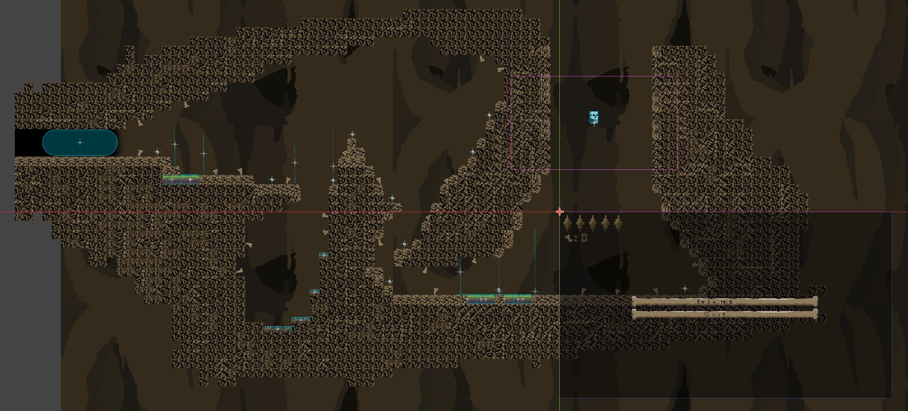
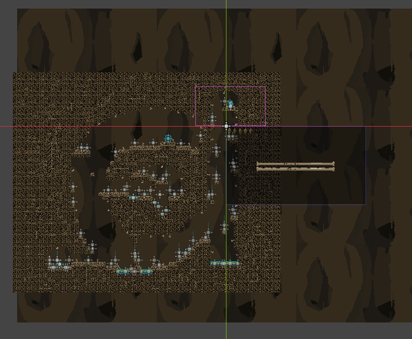
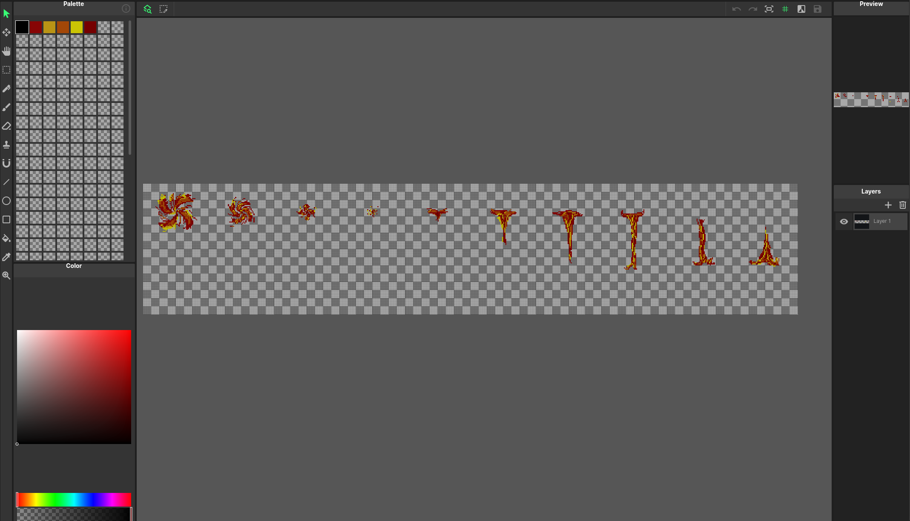
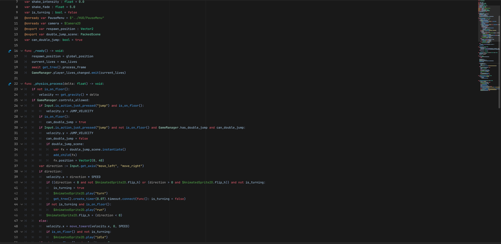

# Bones
Bones is a rather simple platformer game created in the Godot Game engine. You start as a skull and collect coins to attempt to 'buy' back the rest of your body. You then gain a double jump and continue the parkour. 

  

## How it was made
All of the levels were designed by hand as was all the art, sounds, music, and code. The pixel art was drawn in Godot's extension, PixelPen. Sound was recorded on a and imported into Godot and the music was made in MuseScore and exported from there.  The rest of the stuff was made in Godot.

	

	

## Why it was made

I decided to make this game to improve on my python skills because Godot Script is very similar to python. I started making the game with very little knowledge of python but using guides and videos, I was able to improve.

	

 
To play this game, go to https://couchpotatoe1234.itch.io/bones